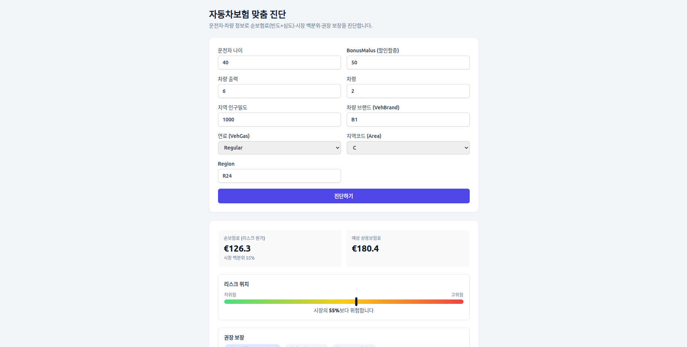

# auto-insurance-diagnosis

개인 리스크(빈도×심도) 예측 → 적정 보장·보험료 진단/추천 시스템.
기획안: `../insurance-project-plans/02_auto_insurance_custom_diagnosis.md`

운전자/차량 정보로 **청구 빈도·심도를 예측**하고 **순보험료(pure premium)** 를 산출하여,
시장 분포 대비 백분위·권장 보장 수준을 **맞춤 진단**한다. (계리 정석: frequency × severity)



> 위 화면: React 웹 UI(M5). 운전자/차량 9개 항목을 입력하면 **순보험료·예상 상용보험료**, **시장 백분위 게이지**, **권장 보장**, SHAP 리스크 요인, 시장 분포·코호트·EDA 통계 패널을 함께 보여준다.

---

## 빠른 시작

```bash
# 1) 백엔드 — 엔진 학습 후 API 서빙
cd backend
conda activate py311_pt
pip install -r requirements.txt
python scripts/train_diagnosis.py          # models/diagnosis_engine.joblib 생성 (최초 1회)
uvicorn app.main:app --reload              # http://127.0.0.1:8000  (/docs Swagger)

# 2) 프론트엔드 — React 웹 UI (별도 터미널, Node 18 고정)
cd frontend
nvm use                                    # .nvmrc → 18.20.8
npm ci
npm run dev                                # http://127.0.0.1:5173  (/api → :8000 프록시)
```

> 엔진 파일이 없으면 `POST /diagnose` 가 503 을 반환한다 → `train_diagnosis.py` 를 먼저 실행할 것.

---

## 아키텍처 한눈에

```
[React SPA :5173]  ──/api 프록시──▶  [FastAPI :8000]  ──▶  DiagnosisEngine(joblib)
 DriverForm·ReportCard               /diagnose                빈도(LightGBM) × 심도(GLM)
 통계 패널(recharts)                 /market/stats·/eda        → isotonic → 백분위·보장·SHAP
                                                              ▲
                              [학습 파이프라인 scripts/] ──────┘  freMTPL2 + KOSIS raking 보정
```

설계 문서(`docs/`):
- [`architecture.md`](docs/architecture.md) — 전체 시스템 구조(백엔드·프론트·요청 흐름)
- [`uml.md`](docs/uml.md) — 클래스·시퀀스·컴포넌트 다이어그램(Mermaid)
- [`frontend-tech-review.md`](docs/frontend-tech-review.md) — Node 18 고정 스택 선정 근거
- [`statistics-feature-review.md`](docs/statistics-feature-review.md) — 통계 패널(T1~T3) 설계

---

## 데이터

- **freMTPL2freq** (~678,013 policies) — 빈도
- **freMTPL2sev** (26,639 claim 관측치) — 심도
- (선택) **Porto Seguro** — 청구확률 이진 트랙

`data/raw/`에 원본 CSV를 두고, 전처리 산출물은 `data/processed/`에 저장(둘 다 git 제외).
로컬 CSV가 없으면 OpenML(`fetch_openml`)에서 자동 로드한다.

### ⚠️ freMTPL2 전처리 필수 (무시 시 모델 왜곡)
- 정합성 불일치: freq `ClaimNb` ≠ sev 매칭 claim 수인 정책 **9,117 / 678,013**, 고아 claim **195 / 26,639**
- 표준 capping: `ClaimNb` ≤ **4**, `Exposure` ≤ **1** (데이터 오류 의심)
- freMTPL2엔 **성별 변수 없음** → 공정성 실증은 freMTPL1/proxy 필요

---

## 로드맵

| 단계 | 내용 | 모듈 | 상태 |
|---|---|---|---|
| M1 | EDA·전처리(정합성·capping·고아 claim)·GLM 베이스라인 | `data/`, `models/glm.py` | ✅ |
| M2 | Poisson/Tweedie GBM, policy 단위 CV, Tweedie power 탐색 | `models/gbm.py` | ✅ |
| M3 | 순보험료 통합 + auto-calibration 검증/재보정 + SHAP | `evaluation/`, `scripts/evaluate_engine.py` | ✅ |
| M4 | 진단/추천 레이어(보험료·보장 매핑) | `diagnosis/` | ✅ |
| M5 | 데모(FastAPI + React SPA) · 통계 패널(시장/코호트/EDA) | `app/`, `frontend/` | ✅ |

---

## 저장소 구조 (모노레포)

```
backend/   # Python — ML 파이프라인 + FastAPI/Streamlit 데모
frontend/  # React + Vite + Tailwind 웹 UI (MVP) — Node 18 고정
docs/      # 아키텍처·UML·기술 검토 설계 문서
demo.png   # 웹 UI 화면 캡처
```

### backend 구조
```
src/auto_insurance/
  data/        # 로드·정합성검증·capping·split
  features/    # 인코딩·노출 오프셋
  calibration/ # raking(IPF) · KOSIS 마진 수집(한국 분포 보정)
  models/      # glm / gbm · weights(raking→sample_weight)
  evaluation/  # deviance · gini/lift · calibration
  diagnosis/   # 백분위 진단 · 보장 매칭 룰 · grossing-up · DiagnosisEngine
app/           # FastAPI(main.py) / Streamlit(streamlit_app.py) 데모
scripts/       # 학습 파이프라인(train_baseline · train_gbm · evaluate_engine · train_diagnosis)
```

### frontend 구조
```
src/
  api/diagnose.js              # fetch 래퍼 (diagnose · fetchMarketStats · fetchEda)
  components/
    DriverForm.jsx             # 입력 폼 (9 필드)
    ReportCard.jsx             # 리포트 오케스트레이터
    PercentileGauge.jsx        # 백분위 게이지
    ShapChart.jsx              # SHAP 요인 차트 (recharts)
    MarketHistogram.jsx        # 시장 분포 히스토그램 (recharts)
    CohortCompare.jsx          # 코호트 비교 차트 (recharts)
    EdaPanel.jsx               # 요율 인자 EDA 그리드 (recharts)
  App.jsx                      # 전역 상태(report/error/loading)
```

---

## 학습 파이프라인 실행 (backend)

```bash
cd backend

# M1: GLM 빈도(Poisson)+심도(Gamma)
python scripts/train_baseline.py                 # openml, 10만 표본
python scripts/train_baseline.py --sample 0      # 전체 678,013행
python scripts/train_baseline.py --no-raking     # 한국 분포 보정 끄고 비교

# M2: LightGBM 빈도(Poisson, early stopping) · 순보험료(Tweedie)
python scripts/train_gbm.py                      # GLM 대비 lift + Tweedie power 탐색
python scripts/train_gbm.py --sample 0

# M3: 통합 엔진 — 순보험료(빈도×심도) + auto-calibration 재보정 + SHAP
python scripts/evaluate_engine.py

# M4: 진단/추천 — 엔진 학습 → 정책별 맞춤 리포트 → models/diagnosis_engine.joblib 저장
python scripts/train_diagnosis.py

# M5: 데모 — 저장된 엔진 서빙
uvicorn app.main:app --reload          # http://127.0.0.1:8000/ (폼) · /docs (Swagger)
streamlit run app/streamlit_app.py     # Streamlit UI (보조)
```

각 단계 파이프라인:
- **M1**: 로드 → 정합성검증·capping·고아claim → 설계행렬 → policy 단위 split → raking(KOSIS 2024) → GLM → deviance·Gini·순보험료 Gini.
- **M2**: GBM 빈도(early stopping) vs GLM 비교 + **policy 단위 CV로 Tweedie power 탐색**(검증 Gini 최대화).
- **M3**: 순보험료 통합(빈도 GBM × 심도 GLM) → **auto-calibration 검증(balance·cohort오차) → isotonic 재보정** → SHAP 리스크 요인.
- **M4**: 엔진(`diagnosis/engine.py`) → 정책별 **맞춤 진단 리포트**(순보험료·시장 백분위·보장권장·grossing-up·per-policy SHAP) + joblib 저장.
- **M5**: **데모** → 저장 엔진 로드, React 폼/`POST /diagnose` 로 진단 서빙 + 시장/코호트/EDA 통계 패널.

---

## 환경 (backend)
```bash
cd backend
conda activate py311_pt
pip install -r requirements.txt
```

### 한국 분포 보정(raking) → 학습 가중치 연결
```python
from auto_insurance.config import load_config
from auto_insurance.models.weights import training_weight
from auto_insurance.models.gbm import fit_poisson_frequency

cfg = load_config()
# 빈도: 노출은 offset, raking 가중치를 sample_weight 로
w = training_weight(cfg, df, dataset="fremtpl2", base_weight=None)
model = fit_poisson_frequency(X, df.ClaimNb, df.Exposure, sample_weight=w)
# 심도: training_weight(..., base_weight=claim_count) / 순보험료: base_weight=exposure
```
KOSIS 마진은 `python -m auto_insurance.calibration.kosis` (키는 `.env` 의 `KOSIS_API_KEY`).
