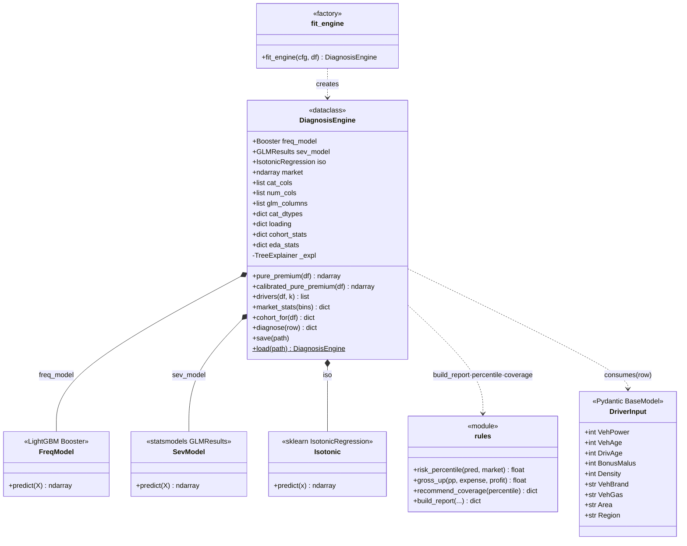
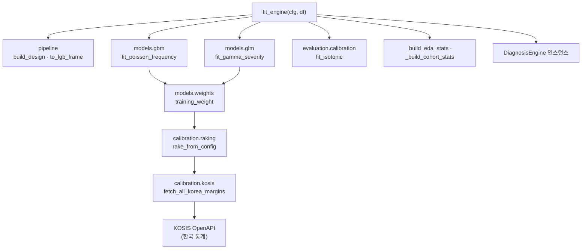
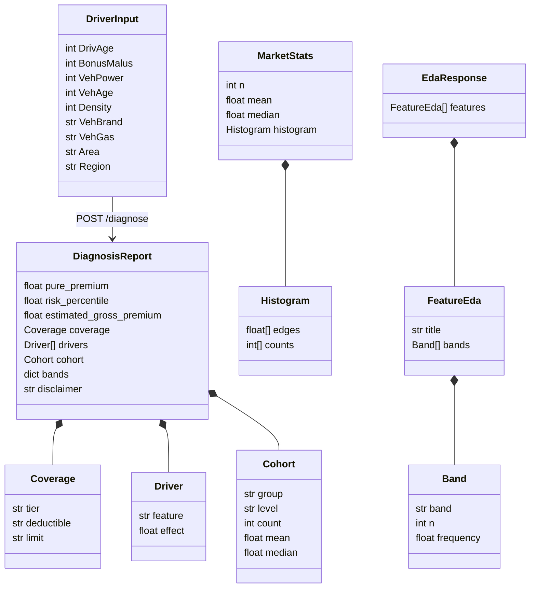
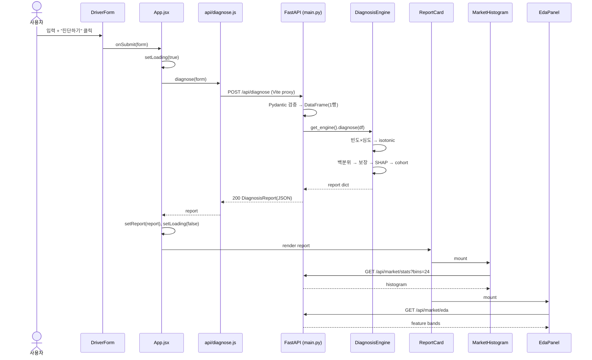
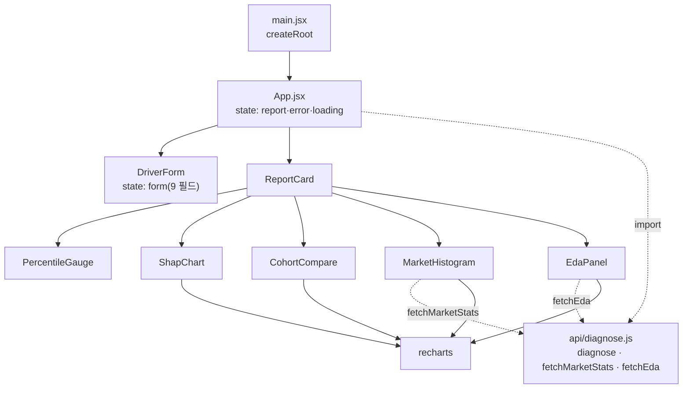
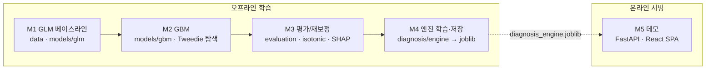

# UML 다이어그램

> 대상: **auto-insurance-diagnosis** · 작성일: 2026-06-07
> Mermaid 문법으로 작성(GitHub·대부분 마크다운 뷰어에서 렌더링). 전체 구조 설명은 [`architecture.md`](./architecture.md) 참고.

---

## 1. 백엔드 클래스 다이어그램 — 진단 엔진

핵심 서비스 `DiagnosisEngine` 와 협력 모델/규칙의 구성 관계.

---

## 2. 백엔드 모듈 의존 그래프 — 학습 파이프라인

`fit_engine` 이 호출하는 협력 모듈(데이터→보정→모델→평가).

---

## 3. 데이터 모델 — 입출력 스키마

요청(`DriverInput`)부터 응답(`DiagnosisReport`)까지의 데이터 형상.

---

## 4. 진단 요청 시퀀스 다이어그램

폼 제출부터 리포트 시각화까지의 전체 흐름(프록시·지연 후속 조회 포함).

---

## 5. 프론트엔드 컴포넌트 다이어그램

React 컴포넌트 트리와 API 클라이언트 의존.

---

## 6. 학습/서빙 단계 흐름 (로드맵 M1~M5)

